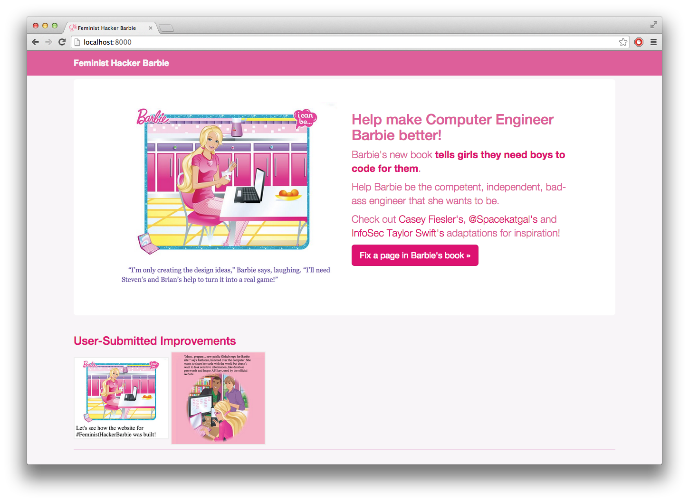

# #FeministHackerBarbie Website Code
I wanted to share the code behind the website, in case you #FeministHackerBarbie ignited your curiosity about programming! Or about building Django web apps or image manipulation in the browser! It's all here... take a look. 

 

## How to run
Feel free to check out this code and try running the site yourself. You'll need Django 1.7 and Sqlite (and possibly some other dependencies, too). Run it with:

    python manage.py runserver 

And go to http://localhost:8000 in your browser.

## Local SQLite database
The real site doesn't use sqlite, but this version comes with a file called `barbie.db` that is meant to be the database for the app. It is pre-populated with the pages from the book and with a couple examples that I just made. 

If you ever mess up this database, BarbiePage.sql contains the sqlite commands needed to repopulate the `cebarbie_barbiepage` database table. Without it, the website won't know what images to show, or where on the image to put the replacement text. 

## Imgur API
I use Imgur to host the images. You can find out about their API here and get yourself an API client ID to use in your version of the app. Set it in [cebarbie/settings.py](cebarbie/settings.py)

## Other... 
Uhm, ask me questions! 